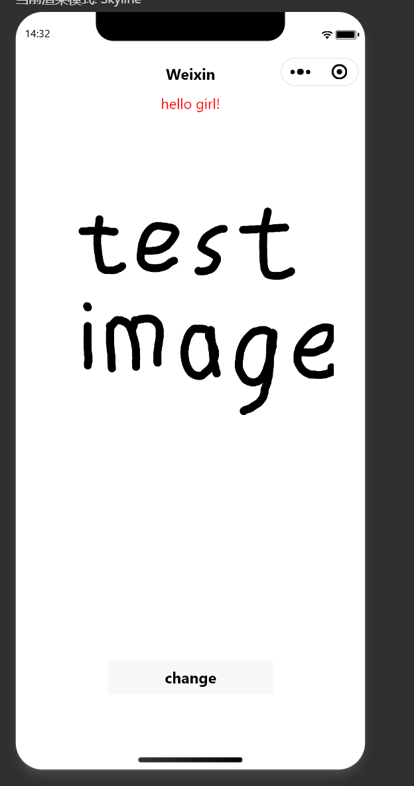
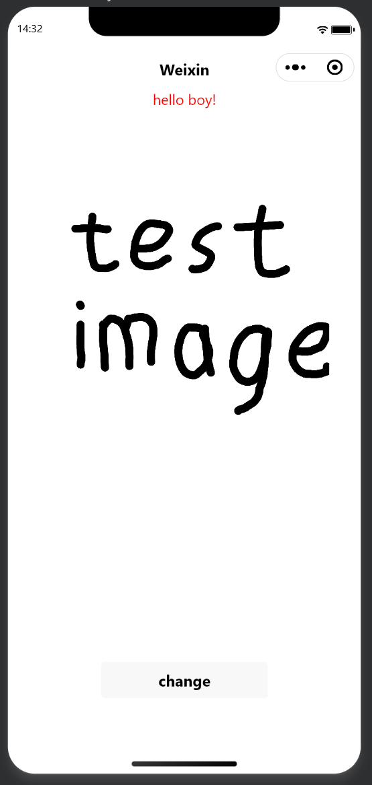

<center>姓名：24020007175  学号：周洋迅</center>

| 姓名和学号？         | 周洋迅，24020007175              |
| -------------------- | -------------------------------- |
| 本实验属于哪门课程？ | 中国海洋大学26夏《移动软件开发》 |
| 实验名称？           | 实验1：热身运动                  |
|博客地址		| https://blog.csdn.net/2401_85763240/article/details/164022586 |
|github仓库地址	| https://github.com/zysgusg/mobileDev |
## 一、实验内容

本次实验主要完成了第一个微信小程序的创建与运行，具体步骤和核心代码如下：

### 1. 环境准备与项目创建

**下载安装**：从微信官方文档下载并安装了最新版**微信开发者工具**。

**创建项目**：在桌面新建一个空白文件夹，打开开发者工具，使用测试号创建了一个不使用云服务、不使用模板的空白小程序项目。

### 2. 实现“Hello World”交互功能

根据课程提供的官方视频教程，完成了点击按钮改变页面文字的功能。这让我初步理解了小程序四种核心文件的分工：

**`wxml` 文件**：负责页面结构，类似于HTML。我在其中定义了一个文本和一个按钮并插入一张图片。

```html
  <view class="title">
    hello {{gender}}!
  </view>
  <image class="img" src="../../img/test.png" mode="widthFix"></image>
  <button bindtap="onClick">change</button>
```

**`wxss` 文件**：负责页面样式，类似于CSS。用于设置文字居中、边距、颜色和按钮样式。

```css
.title{
  color: rgb(255, 0, 0);
}
```

**`js` 文件**：负责页面逻辑。我定义了`data`中的`gender`数据，并编写了`onClick`函数来响应按钮点击。

```javascript
Page({
  data:{
    gender:'girl'
  },
  onClick:function(){
    if(this.data.gender=='girl')
      this.setData({
        gender:'boy'
      })
    else
      this.setData({
        gender:'girl'
      })
  }
})
```

**`json` 文件**：负责页面配置（本次实验未作修改）。

### 效果展示

初始状态

点击按钮奇数次


## 二、问题总结与体会

### 按钮与图片不居中

**解决**：在外层包裹view容器，并设置为display: flex ，再调整view容器的样式。

### 按钮不能来回切换文字

**解决**：使用if-else语句判断按按钮时数据，再设置文字

