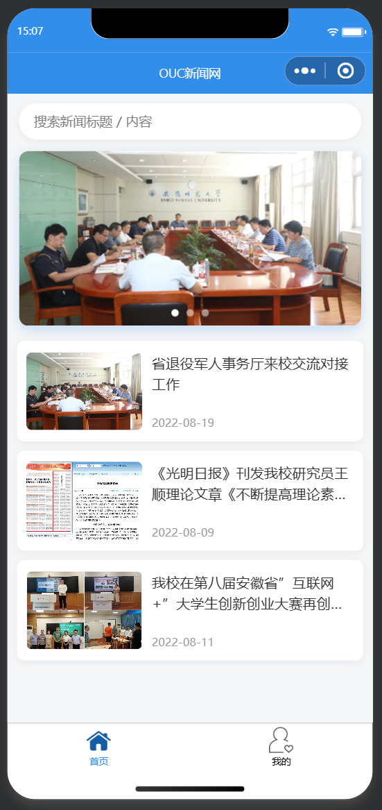
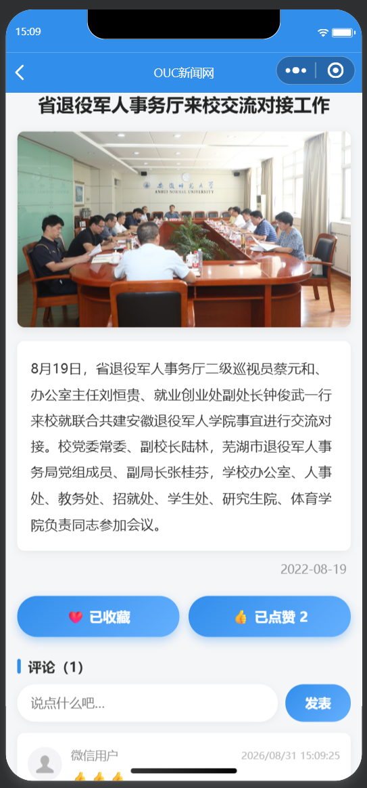
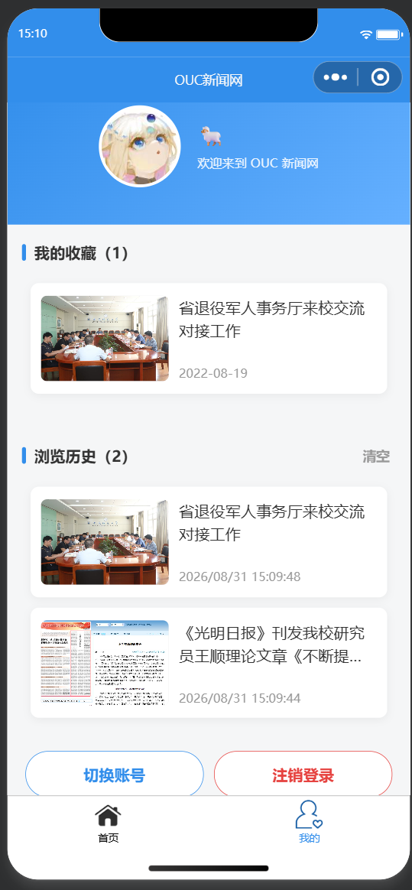

<center>姓名：周洋迅  学号：24020007175</center>

| 姓名和学号？         | 周洋迅，24020007175                                          |
| -------------------- | ------------------------------------------------------------ |
| 本实验属于哪门课程？ | 中国海洋大学26夏《移动软件开发》                             |
| 实验名称？           | 实验3：高校新闻网                                            |
| 博客地址？           | https://blog.csdn.net/2401_85763240/article/details/164212309 |
| 代码仓库地址？       | https://github.com/zysgusg/mobileDev                         |

## 一、实验内容

本次实验基于模拟数据实现一个简易的高校新闻小程序，综合运用前面实验学到的视图与逻辑知识。项目共三个页面：首页（搜索 + 新闻列表）、新闻详情页（全文阅读、收藏、点赞、评论）、个人中心页（登录、收藏夹、浏览历史、账户管理），其中首页和个人中心以 tabBar 形式切换。实验提供 `common.js` 模拟数据文件、图片素材以及首页部分代码，其余页面与功能（登录、收藏、点赞、评论、浏览历史、搜索、注销/切换账号）的视图和逻辑需要自己完成。

### 1. 项目创建与全局配置（`app.json`）

新建空白项目后，在 `app.json` 中注册 `detail` 和 `my` 两个页面，并配置导航栏与 tabBar。导航栏采用海大蓝 `#328EEB`，标题为"OUC新闻网"；tabBar 包含"首页"和"我的"两个 tab，切换时图标会变为蓝色选中态：

```json
"window": {
  "navigationBarTextStyle": "white",
  "navigationBarTitleText": "OUC新闻网",
  "navigationBarBackgroundColor": "#328EEB"
},
"tabBar": {
  "color": "#000000",
  "selectedColor": "#328EEB",
  "list": [
    {
      "pagePath": "pages/index/index",
      "text": "首页",
      "iconPath": "images/index.png",
      "selectedIconPath": "images/index_blue.png"
    },
    {
      "pagePath": "pages/my/my",
      "text": "我的",
      "iconPath": "images/my.png",
      "selectedIconPath": "images/my_blue.png"
    }
  ]
}
```

### 2. 首页设计（`index`）

首页由三部分组成：顶部搜索栏、`<swiper>` 幻灯片（3 幅图片自动轮播，`indicator-dots` 显示指示点、`interval` 控制间隔；图片用 `mode="aspectFill"` 铺满并加了圆角与阴影）、新闻列表（`wx:for` 遍历 `newsList` 渲染）。每条新闻以卡片形式展示海报图、标题（超长时两行省略）和日期，点击跳转到详情页：

```xml
<!--搜索栏-->
<view class="search-bar">
  <input class="search-input" placeholder="搜索新闻标题 / 内容" confirm-type="search"
    value="{{keyword}}" bindinput="onSearchInput" />
</view>
<!--幻灯片滚动-->
<view class="swiper-wrap">
  <swiper class="banner" indicator-dots="true" autoplay="true" interval="5000" duration="500"
    indicator-color="rgba(255,255,255,0.5)" indicator-active-color="#ffffff">
    <block wx:for="{{swiperImg}}" wx:key='swiper{{index}}'>
      <swiper-item>
        <image src="{{item.src}}" data-id="{{item.id}}" bindtap="goToDetail" mode="aspectFill"></image>
      </swiper-item>
    </block>
  </swiper>
</view>
<!--新闻列表-->
<view id='news-list' class="news-list">
  <view class='list-item' wx:for="{{newsList}}" wx:for-item="news" wx:key="{{news.id}}">
    <image src='{{news.poster}}' mode="aspectFill"></image>
    <view class="list-info">
      <text class="list-title" bindtap='goToDetail' data-id='{{news.id}}'>{{news.title}}</text>
      <text class="list-date">{{news.add_date}}</text>
    </view>
  </view>
</view>
<!--搜索无结果提示-->
<view class="search-empty" wx:if="{{keyword && newsList.length == 0}}">未找到相关内容</view>
```

**搜索功能**：输入时按标题/正文关键字实时过滤（忽略大小写），`onLoad` 时把完整列表额外存入 `allNews` 作为过滤数据源，关键字清空后自动恢复完整列表：

```javascript
onSearchInput: function(e) {
  let keyword = e.detail.value.trim()
  let list = this.data.allNews
  if (keyword) {
    //匹配标题或正文，忽略大小写（列表项可能不含 content，需判空）
    list = list.filter(news => {
      let title = (news.title || '').toLowerCase()
      let content = (news.content || '').toLowerCase()
      let word = keyword.toLowerCase()
      return title.indexOf(word) > -1 || content.indexOf(word) > -1
    })
  }
  this.setData({ newsList: list, keyword: e.detail.value })
}
```

> 注意：`getNewsList()` 原实现没有拷贝 `content` 字段，过滤时对 `undefined` 调用 `toLowerCase()` 会抛异常导致"输入无反应"，已补上该字段并在过滤时做判空保护（详见问题 5）。

新闻列表采用统一的卡片样式（圆角白色卡片、图片圆角、标题两行省略、日期置灰），该样式由首页和个人中心共享，统一定义在全局 `app.wxss` 中：

```css
.list-item {
  display: flex;
  align-items: center;
  padding: 20rpx;
  margin-bottom: 20rpx;
  background: #ffffff;
  border-radius: 16rpx;
  box-shadow: 0 4rpx 16rpx rgba(0, 0, 0, 0.05);
}
.list-item image {
  width: 240rpx;
  height: 160rpx;
  border-radius: 12rpx;
  margin-right: 20rpx;
}
.list-title {
  font-size: 30rpx;
  color: #333;
  line-height: 1.5;
  display: -webkit-box;
  -webkit-box-orient: vertical;
  -webkit-line-clamp: 2;
  overflow: hidden;
}
.list-date {
  font-size: 24rpx;
  color: #999;
}
```

页面逻辑中，`onLoad` 时调用 `common.getNewsList()` 获取模拟新闻列表；`goToDetail` 从点击元素的 `dataset` 中取出新闻 `id`，通过 `wx.navigateTo` 携带参数跳转详情页：

```javascript
goToDetail: function(e) {
  let id = e.currentTarget.dataset.id;
  wx.navigateTo({
    url: '../detail/detail?id=' + id
  })
},
```

### 3. 新闻详情页设计（`detail`）

详情页展示新闻标题、海报、正文和日期，并提供收藏、点赞、评论三个互动功能。

**收藏（按用户 id 保存）**：页面加载时读取**当前用户**的收藏列表（`favorites_<用户id>`），判断当前新闻是否已收藏，据此初始化 `isAdd` 状态：

```javascript
onLoad(options) {
  let id = options.id
  //检查当前新闻是否在当前用户的收藏夹中
  let userId = common.getCurrentUserId()   //当前用户 id
  let myList = common.getFavorites(userId) //该用户的收藏列表
  let exist = myList.filter(item => item.id == id)
  if (exist.length > 0) {                  //已存在
    this.setData({ isAdd: true, article: exist[0] })
  } else {                                 //不存在
    let result = common.getNewsDetail(id)
    if (result.code == '200') {
      this.setData({ article: result.news, isAdd: false })
    }
  }
  this.initLike()      //初始化点赞状态
  this.recordHistory() //记录浏览历史
  this.loadComments()  //加载评论
},
//添加收藏
addFavorites: function() {
  if (!this.checkLogin()) { return }       //未登录拦截
  let article = this.data.article
  let userId = common.getCurrentUserId()
  let list = common.getFavorites(userId)
  if (!list.some(item => item.id == article.id)) {  //避免重复收藏
    list.push(article)
    common.saveFavorites(userId, list)     //按用户 id 保存
  }
  this.setData({ isAdd: true })
},
//取消收藏
cancelFavorites: function() {
  let article = this.data.article
  let userId = common.getCurrentUserId()
  let list = common.getFavorites(userId).filter(item => item.id != article.id)
  common.saveFavorites(userId, list)       //按用户 id 保存
  this.setData({ isAdd: false })
}
```

**点赞（全局计数，其他用户的点赞可见）**：采用"本人状态 + 全局总数"双轨存储——`likes_<用户id>` 记录本人是否点过赞（防止重复计数），`likeCount_<新闻id>` 记录该新闻的点赞总数，点赞时全局 +1、取消时全局 -1，任何账号打开详情页都能看到所有用户的点赞数：

```javascript
// 初始化点赞状态：本人是否点过赞 + 全网点赞总数
initLike: function() {
  let userId = common.getCurrentUserId()
  let likes = common.getLikes(userId)
  let isLiked = likes.indexOf(this.data.article.id) > -1
  this.setData({
    isLiked: isLiked,
    likeCount: common.getLikeCount(this.data.article.id)  //全局点赞总数
  })
},
// 点赞 / 取消点赞
toggleLike: function() {
  if (!this.checkLogin()) { return }       //未登录拦截
  let articleId = this.data.article.id
  let userId = common.getCurrentUserId()
  let likes = common.getLikes(userId)
  let isLiked = !this.data.isLiked
  if (isLiked) {
    likes.push(articleId)
    common.setLikeCount(articleId, common.getLikeCount(articleId) + 1)  //全局 +1
  } else {
    likes = likes.filter(id => id != articleId)
    common.setLikeCount(articleId, Math.max(0, common.getLikeCount(articleId) - 1))  //全局 -1
  }
  common.saveLikes(userId, likes)
  this.setData({ isLiked: isLiked, likeCount: common.getLikeCount(articleId) })
}
```

**评论（公共内容）**：评论按新闻存储于 `comments_<新闻id>`，对**所有账号可见**（与收藏等个人私有数据相反）。每条评论包含昵称、头像、内容、时间，新→旧排列，最多保留 50 条：

```javascript
// 发表评论
submitComment: function() {
  if (!this.checkLogin()) { return }       //未登录拦截
  let content = this.data.commentText.trim()
  if (!content) {
    wx.showToast({ title: '评论内容不能为空', icon: 'none' })
    return
  }
  let user = common.getCurrentUser()       //当前用户（未登录为游客）
  let comment = {
    id: Date.now(),
    nickName: user.nickName,
    avatarUrl: user.avatarUrl,
    content: content,
    time: util.formatTime(new Date())      //评论时间
  }
  common.addComment(this.data.article.id, comment)
  this.setData({ commentText: '' })       //清空输入框
  this.loadComments()                     //刷新评论列表
}
```

```xml
<view class="comment-input-row">
  <input class="comment-input" placeholder="说点什么吧…" value="{{commentText}}"
    bindinput="onCommentInput" confirm-type="send" bindconfirm="submitComment" />
  <button class="comment-btn" bindtap="submitComment">发表</button>
</view>
<view class="comment-list" wx:if="{{comments.length > 0}}">
  <view class="comment-item" wx:for="{{comments}}" wx:for-item="item" wx:key="id">
    <image class="c-avatar" src="{{item.avatarUrl || '../../images/my.png'}}" mode="aspectFill"></image>
    <view class="c-body">
      <view class="c-head">
        <text class="c-name">{{item.nickName}}</text>
        <text class="c-time">{{item.time}}</text>
      </view>
      <text class="c-content">{{item.content}}</text>
    </view>
  </view>
</view>
```

**登录检查**：收藏、点赞、发表评论前先调用 `checkLogin()`，未登录（用户 id 为 `guest`）时弹出提示并引导跳转"我的"页登录：

```javascript
checkLogin: function() {
  let userId = common.getCurrentUserId()
  if (userId !== 'guest') { return true }  //已登录
  wx.showModal({
    title: '提示',
    content: '登录后可进行该操作',
    confirmText: '去登录',
    success(res) {
      if (res.confirm) { wx.switchTab({ url: '/pages/my/my' }) }
    }
  })
  return false
}
```

操作按钮区：收藏与点赞两个按钮并排（`flex` 布局），未操作时白底蓝字、已操作时蓝底白字：

```xml
<view class="fav-btn">
  <button wx:if="{{isAdd}}" class="btn btn-added" bindtap="cancelFavorites">❤️ 已收藏</button>
  <button wx:else class="btn btn-add" bindtap="addFavorites">❤️ 收藏</button>
  <button wx:if="{{isLiked}}" class="btn btn-liked" bindtap="toggleLike">👍 已点赞 {{likeCount}}</button>
  <button wx:else class="btn btn-like" bindtap="toggleLike">👍 点赞 {{likeCount}}</button>
</view>
```

### 4. 个人中心页设计（`my`）

**登录（官方头像昵称填写能力）**：`wx.getUserProfile` 自基础库 2.27.1（2022 年 10 月起）被微信回收，真机上不再返回真实头像昵称（一律灰色头像 + "微信用户"），因此改用官方推荐的"头像昵称填写能力"：

头像：`<button open-type="chooseAvatar">` 唤起头像选择器，`bind:chooseavatar` 回调的 `e.detail.avatarUrl` 为真实头像；

昵称：`<input type="nickname">` 输入框，聚焦时键盘上方可一键填充微信昵称。

点击"未登录，点此登录"后弹出**登录方式选择面板**，可一键选择：

**使用微信账号头像昵称**：先尝试 `wx.getUserProfile`（低版本基础库/旧版微信仍可返回真实信息，作老端兜底）；新客户端拿到匿名信息时自动进入面板内的填写区，用户选头像 + 快捷填昵称后确认登录；

**使用匿名头像昵称**：一键登录，使用微信官方匿名灰色头像 + 昵称"微信用户"。

```xml
<view class="login-popup" catchtap="noop">
  <!-- 第一步：选择登录方式 -->
  <block wx:if="{{loginMode === 'choose'}}">
    <text class="popup-title">选择登录方式</text>
    <button class="popup-btn primary" bindtap="useRealInfo">使用微信账号头像昵称</button>
    <button class="popup-btn" bindtap="useAnonymous">使用匿名头像昵称</button>
  </block>
  <!-- 第二步：官方头像昵称填写能力（新端获取真实头像昵称的唯一途径） -->
  <block wx:else>
    <button class="popup-avatar-btn" open-type="chooseAvatar" bind:chooseavatar="onChooseAvatar">
      <image class="popup-avatar" src="{{src}}" mode="aspectFill"></image>
    </button>
    <input class="popup-input" type="nickname" placeholder="点击填写微信昵称" bindinput="onNicknameInput" />
    <button class="popup-btn primary" bindtap="confirmRealInfo">确认登录</button>
  </block>
</view>
```

登录成功后 `doLogin` 将 `{id, nickName, avatarUrl}` 写入 `currentUser` 缓存（本实验无后端，以**昵称作为用户 id**；匿名账号共用"微信用户"空间），页面 `onLoad` 时从缓存恢复登录态，小程序重启后仍保持登录。未登录的游客在数据层面对应 `guest` 用户。

**收藏列表（按用户 id）**：直接读取当前用户的 `favorites_<用户id>` 收藏数组，配合本地缓存持久化，各账号收藏互不可见：

```javascript
getMyFavorites: function() {
  let userId = common.getCurrentUserId()
  let myList = common.getFavorites(userId)
  this.setData({ newsList: myList, number: myList.length })
}
```

**浏览历史**：详情页每次打开即自动记录（`history_<用户id>`，同一条新闻去重只保留最近一次、新→旧排列、上限 20 条，带浏览时间）；个人中心新增"浏览历史"区块展示列表，标题栏右侧可一键**清空**，点击条目可回看。

**账户操作**：登录后显示"切换账号"与"注销登录"两个按钮——注销清除登录态并清空页面数据，切换账号则注销后立即弹出登录面板重新选择账号。由于收藏、历史、点赞状态均按用户 id 存储，切换账号后互不干扰：

```javascript
// 注销登录：清除登录状态和当前用户信息
logout() {
  wx.removeStorageSync('currentUser')
  this.setData({
    isLogin: false, src: '../../images/my.png', nickName: '',
    showLoginPopup: false, newsList: [], number: 0, historyList: []
  })
},
// 切换账号：注销后立即弹出登录面板
switchAccount() {
  this.logout()
  this.setData({ showLoginPopup: true, loginMode: 'choose' })
}
```

### 5. 功能完善与个性化改进

在完成基础功能后，对小程序做了以下完善：

**登录改用官方头像昵称填写能力**：`wx.getUserProfile` 已回收，真机无法获取真实头像昵称，改用 `chooseAvatar` 按钮 + `nickname` 输入框，并提供"真实信息 / 匿名信息"一键选择弹窗（详见问题 4）；
**数据按可见性分层存储**：个人私有数据（收藏 `favorites_<用户id>`、点赞状态 `likes_<用户id>`、浏览历史 `history_<用户id>`）按用户 id 隔离，公共数据（评论 `comments_<新闻id>`、点赞总数 `likeCount_<新闻id>`）按新闻全局共享——收藏/历史/点赞随账号切换，评论/点赞数所有账号可见；
**注销与切换账号**：登录态持久化到 `currentUser` 缓存（重启恢复），支持一键注销、切换账号（注销 + 弹面板）；
**浏览历史**：自动记录最近浏览的新闻（去重、上限 20 条、带时间），我的页面可查看与清空；
**搜索**：首页按标题/正文关键字实时过滤，无结果时给出空状态提示；
**登录检查**：收藏、点赞、评论三个操作在未登录时弹窗提示"登录后可进行该操作"并引导去登录；
**收藏计数修正**：原实现统计缓存全部 key 会混入系统数据导致计数多 1，后改为"按用户 id 存收藏数组、直接取数组长度"，从根源上消除了该问题；
**幻灯片点击跳转**：给 `swiperImg` 数据补充了对应的新闻 `id`，并为轮播图片绑定点击事件，点击幻灯片即可进入对应新闻详情；
**详情页文字排版优化**：标题加大加粗、正文放入白色卡片并加大行高、两端对齐、日期弱化为浅灰色，阅读体验更舒适；
**整体界面美化**：统一"海大蓝 + 白色卡片"风格——页面背景改为浅灰，轮播图加圆角与阴影，新闻列表由单行文本改为"左图右文"卡片（图片圆角、标题两行省略、日期置灰），个人中心登录区改为渐变蓝色头部卡片（圆形头像 + 昵称 + 欢迎语），收藏/点赞/评论按钮均做两态胶囊样式，文字在按钮内居中。

### 6. 运行效果

首页（搜索栏 + 幻灯片 + 新闻列表）：



新闻详情页（全文 + 收藏/点赞按钮 + 评论区）：



个人中心页（登录状态 + 收藏夹 + 浏览历史 + 账户操作）：



## 二、问题总结与体会

### 问题 1：控制台报错 `isAdd is not defined`（ReferenceError）

**现象**：进入新闻详情页时控制台报 `ReferenceError: isAdd is not defined`，收藏按钮状态错乱。

**解决**：WXML 中的 `{{isAdd}}` 是数据绑定，渲染时会去页面的 `data` 中查找该变量——如果 `data` 里没有声明，就会抛出"未定义"错误。在 `data` 中补上 `isAdd: false` 初始值后问题消失。另外排查时发现，开发者工具编译的是修改前的旧版本 JS，点击工具栏"编译"重新打包后报错不再出现。

**体会**：这让我真正理解了 WXML 数据绑定的作用域机制：模板中出现的每一个变量都必须先在页面的 `data` 中声明，否则渲染层会直接报错；同时调试时要留意开发者工具可能缓存旧代码，改完代码记得重新编译。

### 问题 2：收藏计数始终比实际收藏数多 1

**现象**：收藏 2 条新闻后，"我的收藏"显示数量为 3。

**解决**：`wx.getStorageInfoSync()` 返回的 `keys` 是本地缓存中**所有**的 key，除了收藏的新闻（以新闻 id 为 key），还混有系统写入的其他数据。原来的代码直接取 `keys.length` 作为收藏数量，必然多算。当时改为遍历时用 `obj.id && obj.title` 校验是否为真正的新闻再计数；后来收藏改造成"按用户 id 存收藏数组、直接取数组长度"，从存储结构上彻底消除了这一问题。

### 问题 3：幻灯片不能点击进入详情页

**现象**：轮播图只能自动播放，点击没有反应，无法像新闻列表那样跳转。

**解决**：`swiperImg` 数据源里只有图片地址 `src`，没有新闻 `id`，跳转时没有可携带的参数。给每条数据补上与 `common.js` 中对应的 `id`，并在 `<image>` 上添加 `data-id="{{item.id}}"` 和 `bindtap="goToDetail"`，复用首页已有的跳转函数即可实现"点击幻灯片 → 打开对应新闻"。

### 问题 4：真机调试获取不到微信头像昵称

**现象**：登录时通过 `wx.getUserProfile` 获取头像昵称，开发者工具里正常，真机调试时拿到的只有灰色默认头像和"微信用户"。

**解决**：查证官方规则后确认，微信自 2022 年 10 月 25 日（基础库 2.27.1）起收回了 `wx.getUserProfile` 接口，新客户端一律返回匿名头像昵称，真实信息只能通过官方"头像昵称填写能力"获取——头像用 `<button open-type="chooseAvatar">`，昵称用 `<input type="nickname">`。改造后的登录流程：点击登录弹出选择面板，可一键选择"使用微信账号头像昵称"（先尝试 `getUserProfile` 兼容老端，新端进入填写面板）或"使用匿名头像昵称"（灰色头像 + 微信用户）。

**体会**：开发者工具与真机行为并不完全一致，涉及微信开放能力的功能必须以真机验证为准；平台的接口规则会随版本演进，开发时应优先采用官方文档推荐的最新方案。

### 问题 5：搜索栏输入后无实际功能

**现象**：首页搜索框输入关键字后，新闻列表毫无反应。

**解决**：搜索过滤同时匹配标题与正文，而 `getNewsList()` 返回的列表项并不包含 `content` 字段，`news.content.toLowerCase()` 对 `undefined` 调用方法抛出 TypeError，过滤回调在 `setData` 之前中断，表现为"输入无反应"。修复：过滤时对字段做判空保护（`(news.content || '').toLowerCase()`），并给 `getNewsList()` 补上 `content` 字段让正文关键词也能命中。

**体会**：模拟数据与页面使用的字段必须保持一致，"字段缺失导致的方法调用异常"在界面上往往表现为功能失效而非明显报错，需要结合控制台日志定位问题根源。

### 问题 6：看不到其他用户的点赞

**现象**：账号 A 点赞后计数为 1，切换账号 B 打开同一条新闻，计数仍为 0。

**解决**：原实现把点赞数存在各用户的缓存里，计数只包含本人。改为"本人状态 + 全局计数"双轨存储：`likes_<用户id>` 记录本人是否点过（保证不重复计数），`likeCount_<新闻id>` 记录全网总数，点赞全局 +1、取消全局 -1，任何账号都能看到所有用户的点赞。

**体会**："个人私有数据"（收藏、历史、点赞状态）与"公共共享数据"（评论、点赞总数）在本地存储方案中要用不同的 key 组织方式，设计存储结构前先想清楚数据的可见性范围。

### 收获与体会

本次实验让我把前面学到的知识完整地串了起来：`swiper` 轮播、`wx:for` 列表渲染、`wx:if/wx:else` 条件渲染、`navigateTo` 页面跳转与参数传递，以及 `wx.setStorageSync / removeStorageSync / getStorageInfoSync` 本地存储 API 的配合使用。在此基础上，我还独立完成了搜索、点赞、评论、浏览历史、多账号登录等扩展功能，重点收获有三点：

一是**学会了微信开放能力的正确用法**——`wx.getUserProfile` 被回收后，通过官方"头像昵称填写能力"（`chooseAvatar` + `nickname` 输入框）在真机上拿到了真实头像昵称，也学会了用"兼容老端 + 新端兜底"的方式平滑过渡接口变更；

二是**理解了数据存储结构设计**——按"数据可见性"把本地缓存分为用户私有（收藏/历史/点赞状态，`xxx_<用户id>`）与全局公共（评论/点赞总数，`xxx_<新闻id>`）两类，实现了多账号数据隔离与公共数据的共享展示，切换账号、注销等交互也因此水到渠成；

三是**锻炼了定位真实 bug 的能力**——真机与开发者工具的差异、字段缺失导致的隐性异常、局部缓存计数与全局可见性的矛盾，这些问题都靠控制台日志 + 阅读官方文档一步步排查解决。整个开发过程让我深刻体会到小程序"页面视图 + 逻辑数据分离"的架构思想，调试时利用开发者工具的 AppData 面板观察数据变化非常高效。
