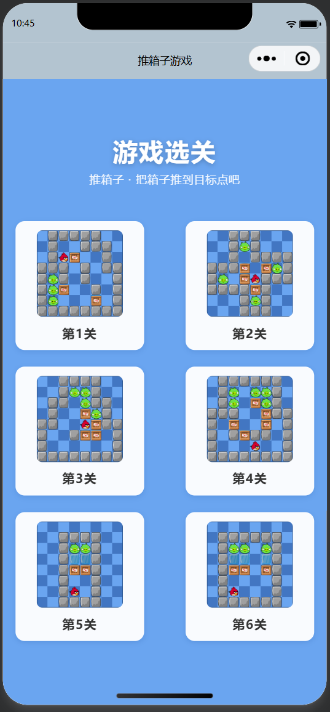
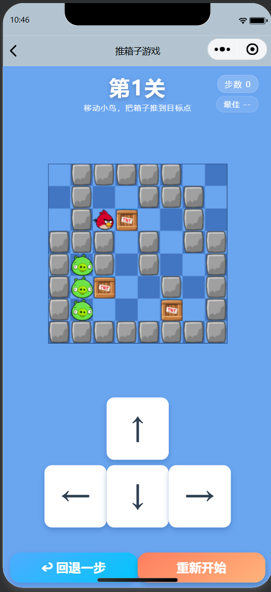
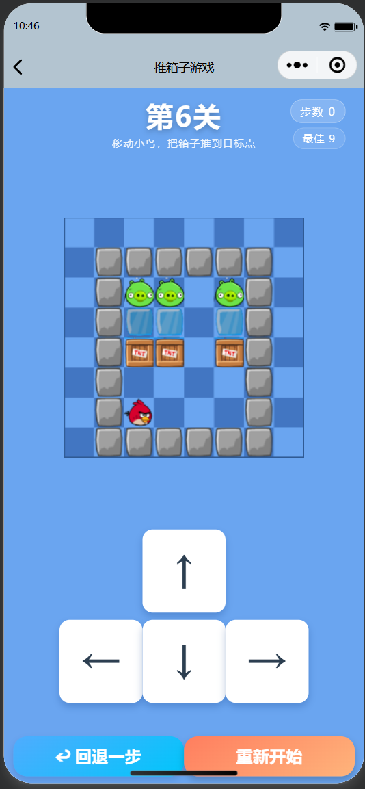

<center>姓名：周洋迅  学号：24020007175</center>

| 姓名和学号？         | 周洋迅，24020007175                                          |
| -------------------- | ------------------------------------------------------------ |
| 本实验属于哪门课程？ | 中国海洋大学26夏《移动软件开发》                             |
| 实验名称？           | 实验4：推箱子小游戏                                          |
| 博客地址？           | https://blog.csdn.net/2401_85763240/article/details/164255300 |
| 代码仓库地址？       | https://github.com/zysgusg/mobileDev                         |

## 一、实验目的

1. 综合应用本课程所学知识，独立完成一个完整的**推箱子小游戏**小程序。
2. 熟练掌握 **`<canvas>` 组件**以及小程序界面 API 中与绘图相关的方法（`wx.createCanvasContext`、`drawImage`、`setFillStyle`、`fillRect`、`setStrokeStyle`、`strokeRect`、`draw` 等）。
3. 掌握页面跳转、数据传递、本地数据存储（`wx.setStorageSync` / `wx.getStorageSync`）、事件绑定等小程序常用开发技能。

## 二、实验内容

实现一个基于 `<canvas>` 绘制的微信小程序「推箱子小游戏」，包含以下功能：

 **首页选关**：展示 6 个关卡，点击关卡卡片跳转到对应游戏页面。
 **游戏页**：
- 使用 canvas 绘制 8×8 地图（墙、路、终点、箱子、人物、特殊格子）。
- 方向键（上 / 下 / 左 / 右）控制小鸟移动、推箱子。
- **特殊格子（ice）**：小鸟或箱子穿过 ice 格子时，若无阻挡会**移动两格**；小鸟把箱子推到 ice 格时，箱子滑行两格、**小鸟只移动一格**。
- **重新开始**：一键还原当前关卡初始状态。
- **回退一步**：撤销上一步操作，并同步减少计步数。
- **计步器**：精确记录每一步；回退时相应减一。
- **最佳记录**：保存当前关卡通关的最少步数（本地持久化），无记录时显示 `--`。
- **通关逻辑**：所有箱子推到终点即通关；通关后**自动进入下一关**，最后一关提示“已完成全部关卡”。
 **地图表现**：地图背景为 8×8 **深浅交替的蓝色方格**，浅蓝色与页面背景颜色一致、无白边；地图四周用**深蓝色细线**描出边界。
  **关卡设计**：1~4 关为基础关卡，5、6 关专门引入 ice 特殊格，并保证可解。

## 三、实验步骤

### 3.1 页面配置

在 `app.json` 中注册首页 `pages/index/index` 与游戏页 `pages/game/game`，并设置导航栏：

```json
{
  "pages": ["pages/index/index", "pages/game/game"],
  "window": {
    "navigationBarBackgroundColor": "####B3C4D0",
    "navigationBarTextStyle": "black",
    "navigationBarTitleText": "推箱子游戏"
  },
  "style": "v2",
  "sitemapLocation": "sitemap.json"
}
```

### 3.2 公共样式

在 `app.wxss` 中定义页面背景与通用容器 / 标题样式：

```css
page { background: ##6aa5f0; }
.container {
  min-height: 100vh;
  display: flex; flex-direction: column; align-items: center;
  justify-content: space-evenly; padding: 30rpx; box-sizing: border-box;
}
.title { font-size: 22pt; font-weight: bold; color: ##fff; letter-spacing: 4rpx; }
```

### 3.3 公共数据（地图）

在 `utils/data.js` 中存放 8×8 地图数据并导出。数值含义：`1` 墙、`2` 路、`3` 终点、`4` 箱子、`5` 人物、`6` 特殊格（ice）、`0` 外围。

```js
var map1 = [
  [0,1,1,1,1,1,0,0], [0,1,2,2,1,1,1,0], [0,1,5,4,2,2,1,0], [1,1,1,2,1,2,1,1],
  [1,3,1,2,1,2,2,1], [1,3,4,2,2,1,2,1], [1,3,2,2,2,4,2,1], [1,1,1,1,1,1,1,1]
];
// ... map2 ~ map4（基础关）  map5、map6（含 ice 特殊格）
module.exports = { maps: [map1, map2, map3, map4, map5, map6] };
```

### 3.4 首页（选关）

`pages/index/index` 的 `data.levels` 存放 6 张关卡预览图，用 `wx:for` 循环渲染卡片并绑定跳转事件：

```js
chooseLevel(e) {
  let level = e.currentTarget.dataset.level
  wx.navigateTo({ url: '/pages/game/game?level=' + level })
}
```

### 3.5 游戏页（核心逻辑）

**初始化与绘制**：`onLoad` 中读取关卡，`initMap()` 解析地图得到墙/路/终点/ice 图层，并记录小鸟起始坐标；`drawCanvas()` 用双重 `for` 循环逐格绘制。

```js
function drawCanvas() {
  ctx.clearRect(0, 0, size, size)
  for (var i = 0; i < 8; i++) for (var j = 0; j < 8; j++) {
    // 8x8 深浅交替蓝色方格（浅色与页面背景一致）
    ctx.setFillStyle((i + j) % 2 === 0 ? '##6aa5f0' : '##4276c2')
    ctx.fillRect(j * w, i * w, w, w)
    if (map[i][j] == 1) ctx.drawImage('/images/icons/stone.png', ...)
    else if (map[i][j] == 3) ctx.drawImage('/images/icons/pig.png', ...)
    else if (map[i][j] == 6) ctx.drawImage('/images/icons/ice.png', ...)
    if (box[i][j] == 4) ctx.drawImage('/images/icons/box.png', ...)
  }
  ctx.drawImage('/images/icons/bird.png', col * w, row * w, w, w)
  // 地图边界：深蓝色细线
  ctx.setStrokeStyle('##2f5a94'); ctx.setLineWidth(2)
  ctx.strokeRect(0, 0, size, size)
  ctx.draw()
}
```

**移动与推箱（含 ice 特殊格）**：统一封装 `move(dr, dc)`，根据方向增量处理小鸟移动、推箱、冰面滑行：

- 前方无阻挡：小鸟前移；若落入 ice 格且再下一格无阻挡，则小鸟滑两格。
- 前方是箱子：尝试推动；若箱子推入 ice 格且再下一格无阻挡，则**箱子滑两格、小鸟只移动一格**。

**胜利判断与通关**：`isWin()` 判断所有箱子是否都位于终点；`checkWin()` 在通关时更新最佳记录，若有下一关则 `wx.redirectTo` 自动进入，否则提示“已完成全部关卡”。

**回退 / 计步 / 最佳记录**：每次有效移动前把当前状态（row、col、box 深拷贝）压入 `history` 栈并计步 `+1`；`undo()` 出栈恢复并计步 `-1`；`restartGame()` 清空历史并重置计步器；最佳记录用 `wx.setStorageSync('sokoban_best', ...)` 按关卡号持久化，取更少步数。

## 四、实验结果

1. **选关界面**：以 6 张关卡预览图卡片展示，图片带深蓝描边，背景为蓝色渐变，点击任意关卡进入对应游戏页面。

   

2. **游戏界面**：顶部显示“第 N 关”、右上角显示“步数 / 最佳”、“方向键（放大两倍并上移，避免误触重新开始）”、底部“回退一步 / 重新开始”按钮。

3. **地图效果**：8×8 深浅交替蓝色方格（浅色与背景一致、无白边、深蓝细线边界），墙 / 终点 / ice / 箱子 / 小鸟分别以对应图标绘制。

4. **交互功能**：

   - 可用方向键移动小鸟并推动箱子，箱子推到终点判定通关。

   - ice 特殊格：小鸟 / 箱子穿过时无阻挡则移动两格，推箱时小鸟仅移动一格。

   - 通关后自动进入下一关；第 6 关通关后提示“恭喜你完成了全部关卡”。

   - 回退一步、重新开始、计步器、最佳记录均正常工作。





## 五、问题与解决方案

1. **选关点击无法进入游戏**：`wx.navigateTo` 使用相对路径 `./game/game` 时被解析为不存在的 `pages/index/game/game`，导致跳转失败。改为绝对路径 `url: '/pages/game/game?level=' + level` 后修复。

2. **游戏按钮超出屏幕**：画布固定为 320px，加上标题、方向键、底部按钮后高度超过屏幕。通过 `wx.getSystemInfoSync()` 读取屏宽/屏高，动态计算画布与方向键尺寸，并用 `flex + space-between` 布局保证所有控件留在屏内。

3. **方向键误触“重新开始”**：方向键与底部按钮间距过小。加大底部按钮行上边距，使方向键整体上移，避免误触。

4. **ice 特殊格规则**：起初推箱经过 ice 时小鸟跟随到第二格，不符合预期。调整为“箱子滑两格、小鸟只移动一格”，并同步修改求解器验证各关仍可解。

5. **最佳记录持久化与撤销一致**：回退不会改变已保存的最佳记录，仅影响当前步数；最佳记录只在通关且步数更少时更新。

## 六、实验总结

通过本次实验，我完整实现了一个基于 `<canvas>` 的推箱子小游戏，深入理解了小程序 canvas 绘图的坐标体系与绘图 API，掌握了页面导航与参数传递、本地数据存储、事件绑定、以及较为复杂的游戏逻辑（移动 / 推箱 / 冰面滑行 / 撤销 / 计步 / 通关判定）。

同时通过实际调试解决了相对路径跳转、布局溢出、交互误触等问题，积累了小程序整体开发与调优的经验。利用 Python + PIL 生成关卡预览图、用求解器验证关卡可解，也帮助我保证了游戏的完整性与可玩性。综上，本次实验达到了预期目标，熟练掌握了 canvas 绘图与小程序的综合应用。
